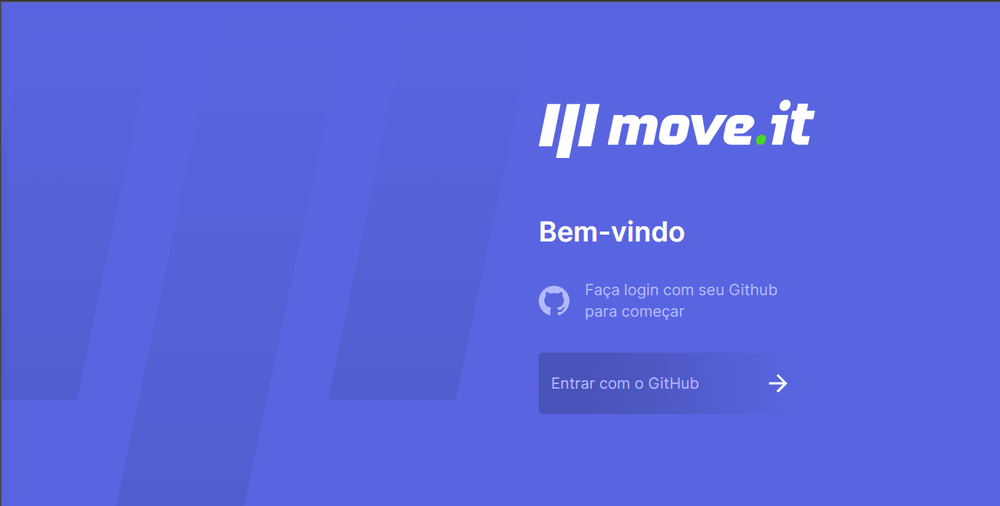
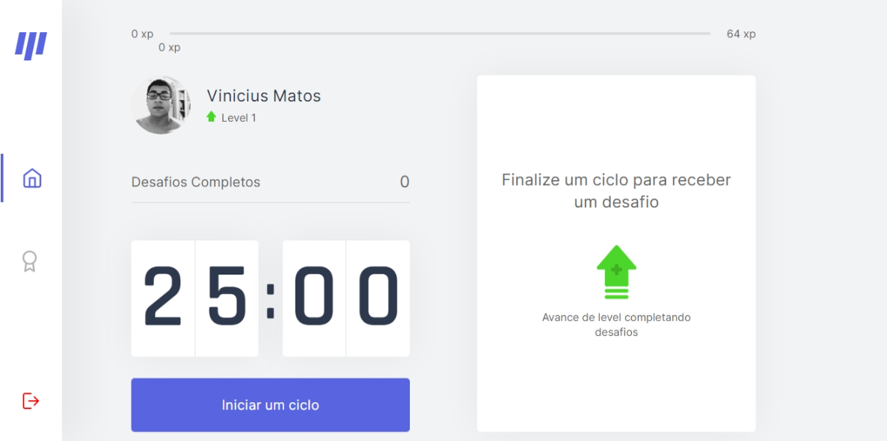
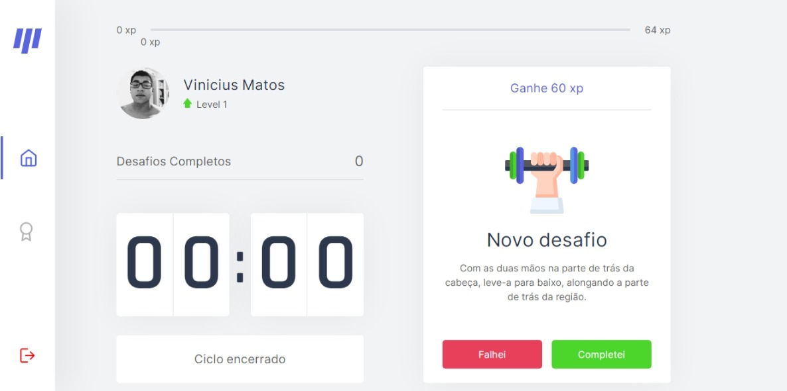
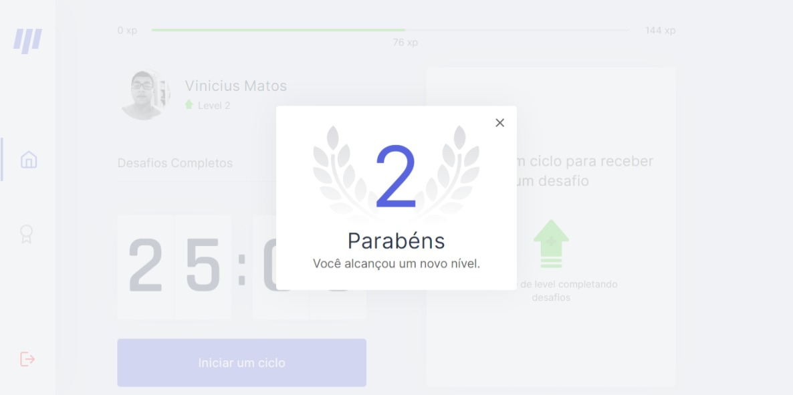

<h1 align="center">Move.it</h1>

<h4 align="center"> 
	🚧  Move.it 🚀 Em construção...  🚧
</h4>

<p align="center">
 <a href="#sobre">Sobre o projeto</a> •
 <a href="#tecnologias">Tecnologias</a> • 
  <a href="#comoexecutar">Como Executar</a> • 
  <a href="#layout">Layout</a> • 
 <a href="#autor">Autor</a>
</p>

<a id="sobre"></a>
## Sobre o projeto
Move.it - é uma forma de aplicar a técnica Pomodoro e utilizar os 5 minutos de descanso como forma de praticar algum exercício para os olhos ou para o corpo, visto que passamos muito tempo sentado.

Projeto desenvolvido durante a NLW - Next Level Week oferecida pela Rocketseat. O NLW é uma experiência online com muito conteúdo prático, desafios e hacks onde o conteúdo fica disponível durante uma semana.

---
<a id="tecnologias"></a>
### 🛠 Tecnologias

As seguintes ferramentas foram usadas na construção do projeto:

- [React](https://pt-br.reactjs.org/)
- [TypeScript](https://www.typescriptlang.org/)
- [Next](https://nextjs.org/)
- [NextAuth](https://next-auth.js.org/)

---
<a id="comoexecutar"></a>
## 🚀 Como executar o projeto

### Pré-requisitos

Antes de começar, você vai precisar ter instalado em sua máquina as seguintes ferramentas:
[Git](https://git-scm.com), [Node.js](https://nodejs.org/en/). 
Além disto é bom ter um editor para trabalhar com o código como [VSCode](https://code.visualstudio.com/)


```bash

# Clone este repositório
$ git clone https://github.com/ViniciusAMatos/move.it.git

# Acesse a pasta do projeto no seu terminal/cmd
$ cd move.it

# Instale as dependências
$ npm install

# Execute a aplicação em modo de desenvolvimento
$ npm run dev ou yarn dev

# A aplicação será aberta na porta:3000 - acesse http://localhost:3000

```
---

<a id="layout"></a>
## 🎨 Layout

<h1 align="center"></h1>

<h1 align="center"></h1>

<h1 align="center"></h1>

<h1 align="center"></h1>

<a id="autor"></a>
## Autor


 

Feito com ❤️ por Vinicius André 👋🏽 Entre em contato!

[](https://www.linkedin.com/in/vinicius-andre-6894a4198/) 
[](mailto:14viniciusandre@gmail.com)
